# 基于Springboot的课程作业管理系统

## Springboot-0011


## 技术栈

Springboot mybatisplus vue mysql maven


## 数据库表(15张)


## 功能介绍

```properties
教学秘书：能够管理学生、教师和课程的信息，实现给教师分配教学任务、查看学生对教师的课程评价、对系统进行反馈等操作；
教师：能够进行课群管理，布置作业，上传资源及答案，对学生的作业进行评分，还可以查看教学任务，对系统进行反馈等操作； 
学生：能够查看作业、资源及答案，提交作业、提出学习上遇到的问题，对教师的教学情况进行网上评教，对系统进行反馈等操作。
```


## 图片

### 前台

### 后台

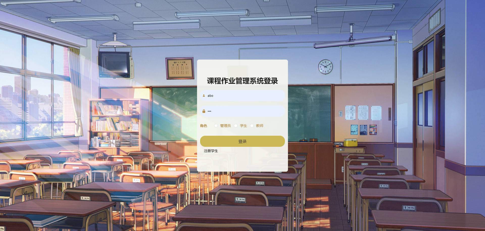

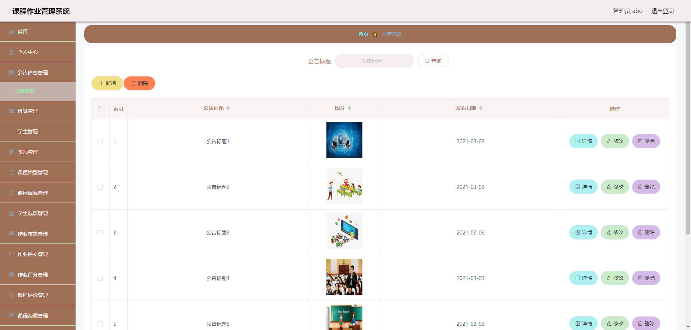


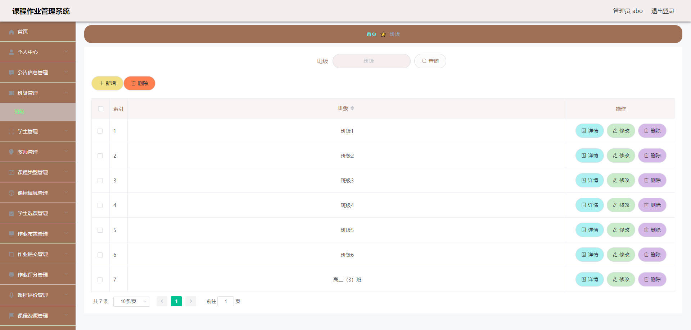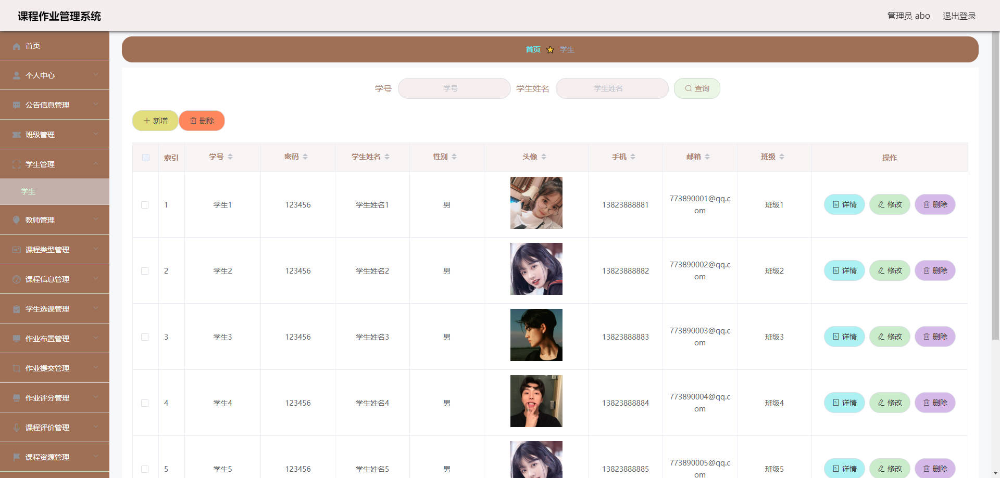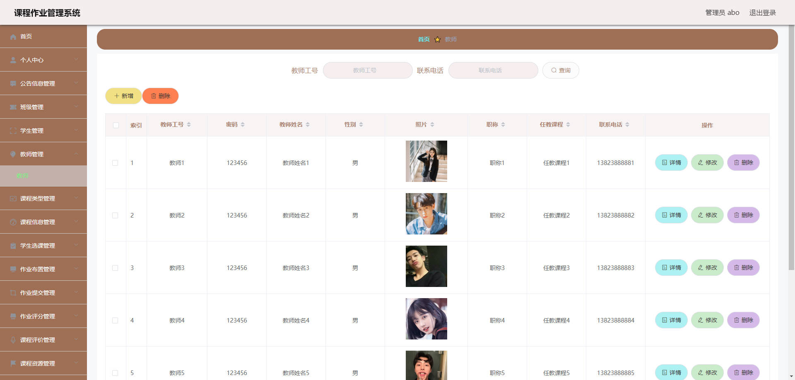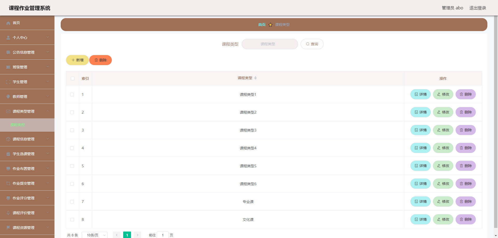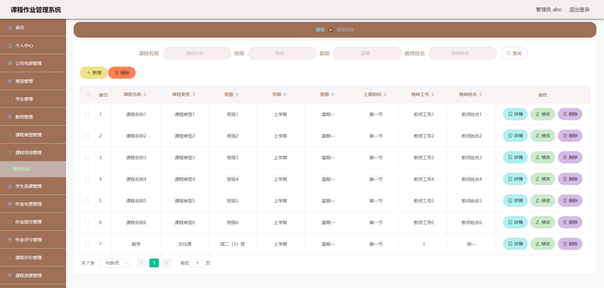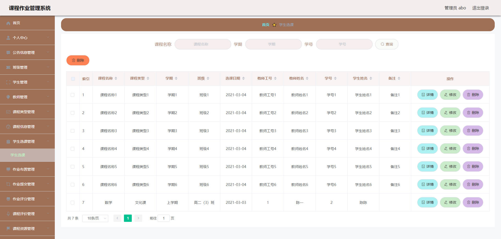

### 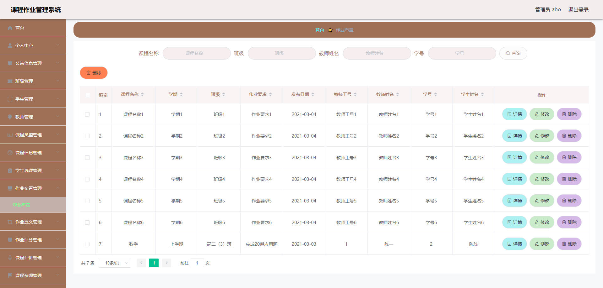

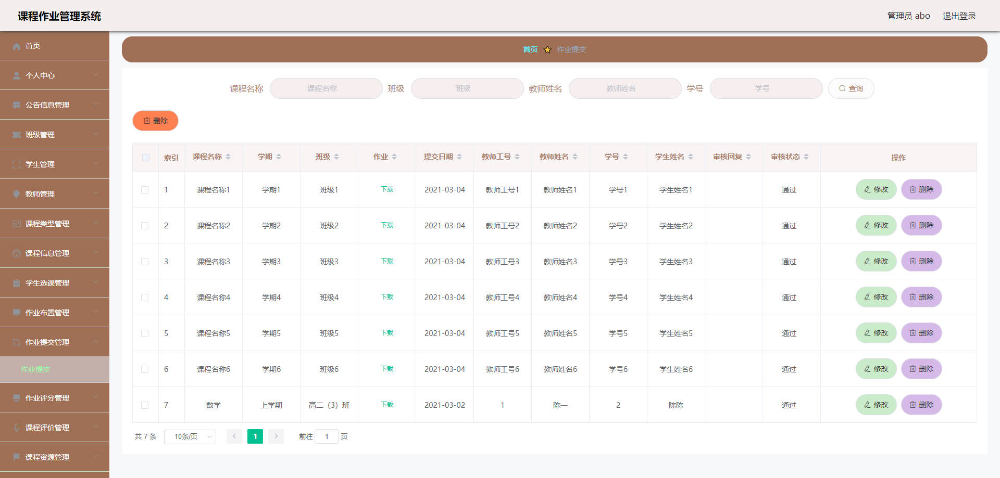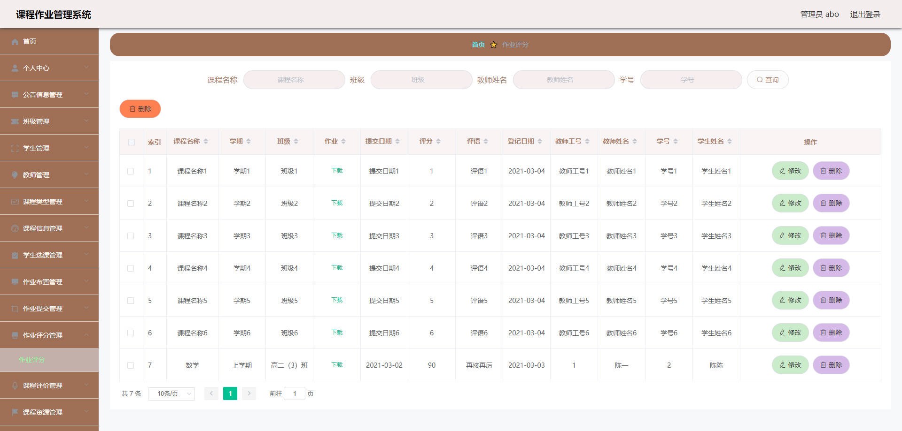

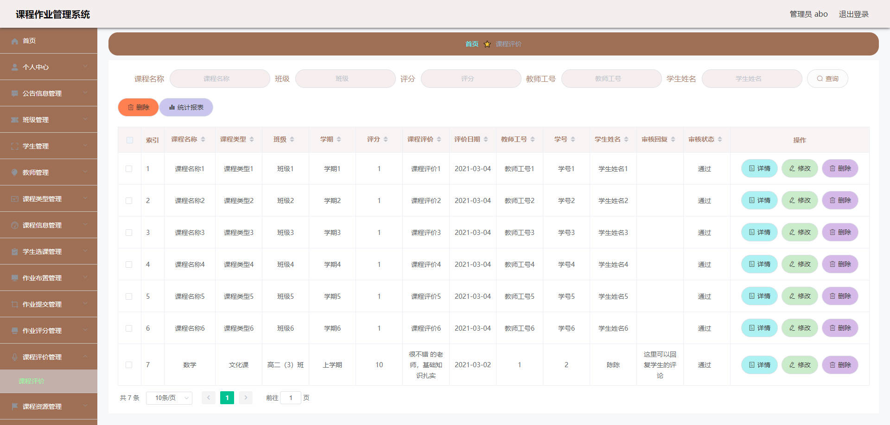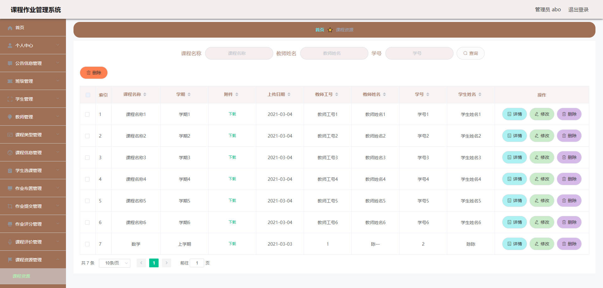


## 访问路径

### 前台

```properties

```

### 后台

```properties
http://localhost:8080/springbootwwiwn/admin/dist/index.html#/login

账号 abo
密码 abo
```


## 功能图

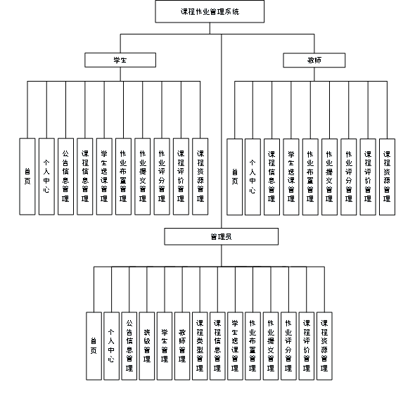


## 文档目录

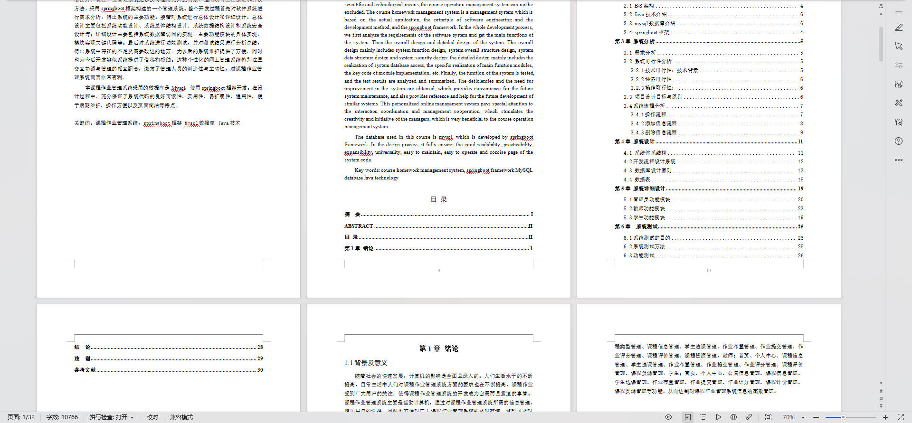


## 打赏或交流


